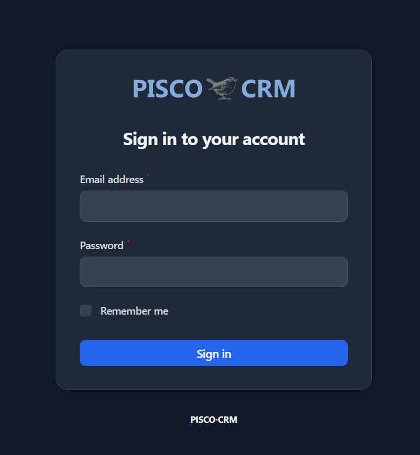
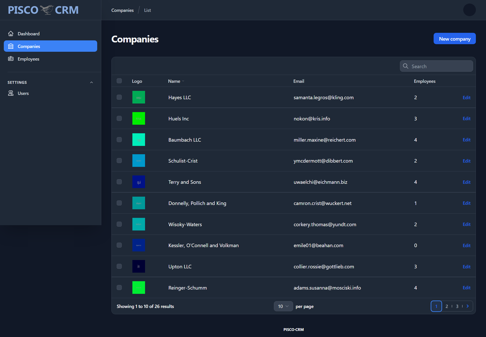
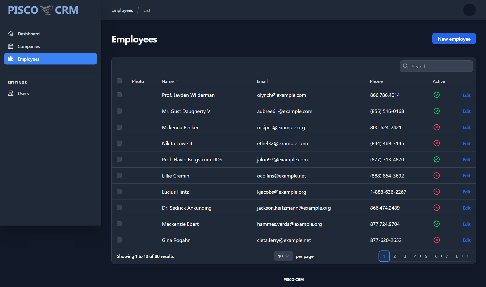

# About PISCO CRM

PISCO is a micro-CRM system (_still in early stages_) for personal, freelance and small businesses.  It can be customized very quickly for Customer Relationship Management, Lead Management System, Project Management or any other usage.

### Tecnologies

- **[Laravel](https://laravel.com/)**
- **[Filament](https://filamentphp.com/)**

### How to Install

1. Clone the repo : `git clone https://github.com/e-evaristo/pisco-crm.git`
2. `$ cd pisco-crm`
3. `$ composer install`
4. `$ cp .env.example .env`
5. `$ php artisan key:generate`
6. `$ php artisan storage:link`
7. `$ php artisan migrate --seed`
8. `$ php artisan serve`
9. Login with :
    - email : `admin@admin.com`
    - password : `password`

### Screenshots

### License

The Pico CRM is open-sourced software licensed under the [MIT license](https://opensource.org/licenses/MIT).
