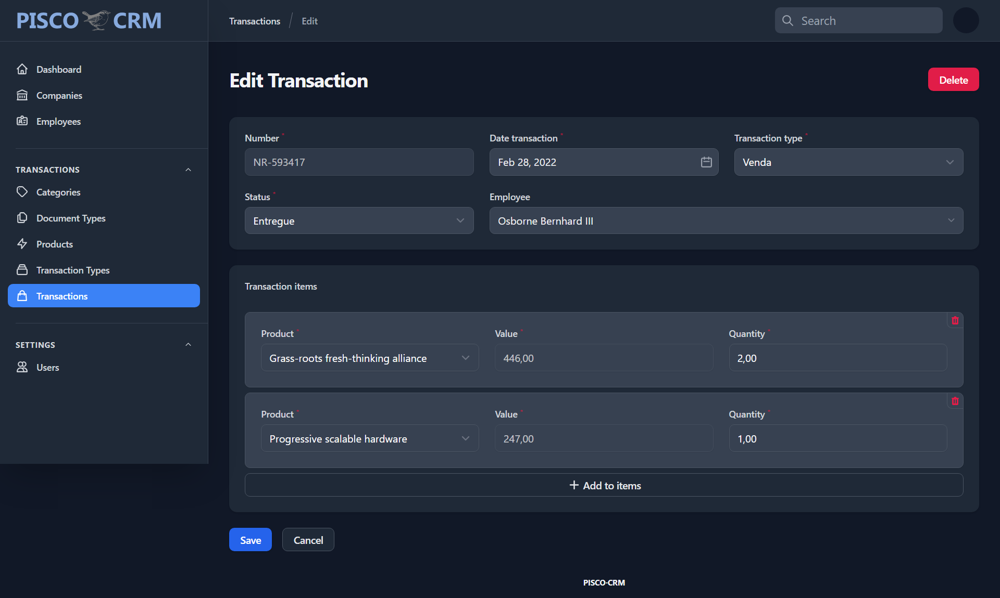

# About PISCO CRM

PISCO is a micro-CRM system (_still in early stages_) for personal, freelance and small businesses.  It can be customized very quickly for Customer Relationship Management, Lead Management System, Project Management or any other usage.

### Tecnologies

- **[Laravel](https://laravel.com/)**
- **[Filament](https://filamentphp.com/)**

### How to Install

01. Clone the repo : `git clone https://github.com/e-evaristo/pisco-crm.git`
02. `$ cd pisco-crm`
03. `$ composer install`
04. `$ cp .env.example .env`
05. `$ php artisan key:generate`
06. `$ php artisan storage:link`
07. Create new MySQL database for this application
08. Set database credentials on .env file
09. `$ php artisan migrate --seed`
10. `$ php artisan serve`
11. Access: http://127.0.0.1:8000/admin
12. Login with :
    - email : `admin@admin.com`
    - password : `password`

### Screenshots

### License

The Pisco CRM is open-sourced software licensed under the [MIT license](https://opensource.org/licenses/MIT).
